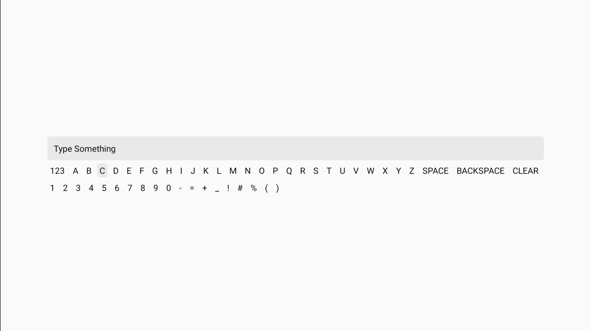

# React Native Inline Keyboard

[](https://badge.fury.io/js/react-native-inline-keyboard)


Inline keyboard for React Native TV Applications



## Installation

```sh
npm install react-native-inline-keyboard
```

## Usage

```jsx
import InlineKeyboard from "react-native-inline-keyboard";

// ...

<InlineKeyboard value={value} onChange={(value) => console.log(value)} />
```

### Props

| Prop | Type |
|------|------|
|value | `string` |
|onChange | `function (value: string`)|
|showInput | `boolean` |
|letterContainerStyles | `StyleProp<ViewStyle>` |
|letterButtonStyles | `StyleProp<ViewStyle>` |
|letterButtonFocusStyles | `StyleProp<ViewStyle>` |
|letterButtonTextStyles | `StyleProp<TextStyle>` |

## License

MIT
